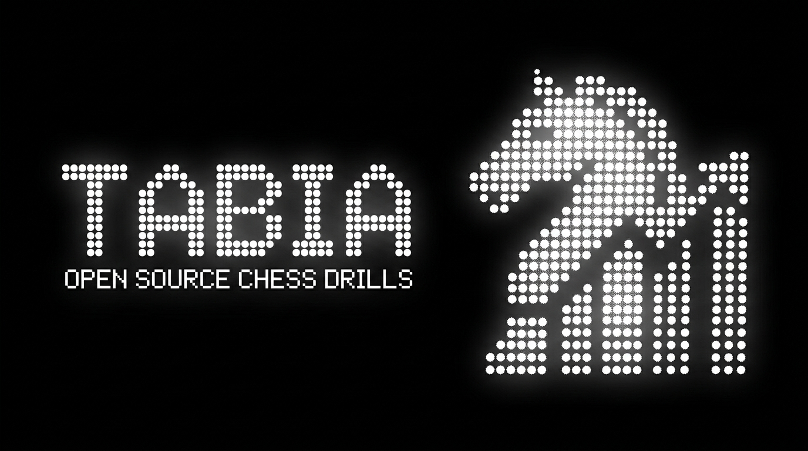

<p align="center">
  
</p>

<p align="center">
  <b>Open-source, browser-local chess opening trainer.</b><br>
  Drill your repertoire with spaced repetition until the moves are muscle memory.<br>
  No account. No server. No tracking — your prep lives in <i>your</i> browser.
</p>

<p align="center">
  <a href="https://daxaur.github.io/tabia/"><b>▶ Live demo</b></a> ·
  <a href="#run-it">Run it</a> ·
  <a href="#add-your-own-opening">Add an opening</a> ·
  MIT
</p>

---

## Why

Most repertoire trainers lock your prep behind an account and a database you don't control.
**tabia** is the open version: a **static site** with **zero backend**. Your progress and
spaced-repetition schedule live in `localStorage`. Fork it, self-host it, run it offline —
it's just HTML, CSS and ES modules.

## What it does

- **Spaced-repetition drilling** — clean a line and it won't come back for a while; miss it and it returns soon.
- **Openings → folders → branch lines** — browse by category (gambits, classical, defences, systems), star and save your favourites.
- **Four study modes** — **Learn** (walk the line), **Practice** (forgiving reps), **Drill** (SRS-scored), and **Hyper** (the bot plays a random line and you must hold your repertoire, round after round).
- **Live Stockfish eval** — a real engine runs in your browser (single-thread WASM) and drives the "winning" bar; an instant heuristic fills in while it spins up.
- **Build your own openings** — a visual builder: play the moves on a board, name your lines, and add custom coach messages per line *and* per move.
- **Coach** — drop your Lichess/Chess.com username and tabia reads your recent games *in the browser*, profiles your style (sharp vs positional, e4 vs d4), and matches an opening to you — rendered as a shareable card you can post to X. No AI bill, no server: just stats over your own game history.
- **Connect an account** — Lichess (OAuth) or Chess.com (public profile); your saved openings are kept locally, tied to you.
- **Buttery board** — big, fast drag *and* click-to-move, lichess-style pieces, right-click arrows/highlights, pre-moves, and synthesized sounds.
- **Browser-local** — no sign-up, no server call, your data never leaves the tab.
- **Verified data** — every bundled line is replayed through `chess.js` (`npm run validate`); illegal moves can't ship.

## Run it

It's a static site — no build step.

```bash
git clone https://github.com/daxaur/tabia
cd tabia
python3 -m http.server 4173    # or: npm run dev
# open http://localhost:4173
```

Deploys to **GitHub Pages** / any static host as-is.

## Add your own opening

An opening is a plain data module: a folder name and a list of lines, each an array of
`[SAN, "comment"]` moves from move 1. The trainer derives the drill positions automatically
(shared prefixes merge by position). Copy a file in `src/data/`, change the moves, and the
opening shows up on the home page. Run `npm run validate` to legality-check every line.

## Project layout

```
index.html            app shell (Home / Study / Coach / Create / Saved)
src/style.css         theme + board styling
src/board.js          dependency-free interactive board (drag, click, arrows, pre-moves)
src/app.js            views + spaced-repetition drill engine + opening builder
src/store.js          localStorage persistence + SRS scheduling
src/engine.js         in-browser Stockfish eval wrapper
src/eval.js           instant heuristic eval (engine-free fallback)
src/coach.js          coach messages (defaults + user overrides)
src/auth.js           Lichess OAuth (PKCE) / Chess.com profile connect
src/coachai.js        Coach — reads your public games, profiles style, matches an opening
src/sharecard.js      renders the Coach result to a shareable PNG (canvas)
src/data/*            openings (folders) and their branch lines
src/vendor/chess.js   chess.js (move legality), vendored
src/vendor/stockfish.js  Stockfish (asm.js), vendored
src/pieces/*          piece sets (SVG)
sw.js                 service worker (network-first, always-fresh)
tools/validate.mjs    legality check for every line
```

## Credits & license

Code: **MIT**. Move legality by [chess.js](https://github.com/jhlywa/chess.js) (BSD),
engine evaluation by [Stockfish](https://stockfishchess.org/) (GPL, vendored as a Web Worker).
Piece sets and the Lichess/Chess.com brand marks are from their respective projects under
their original licenses. Contributions welcome — open an issue or PR.
